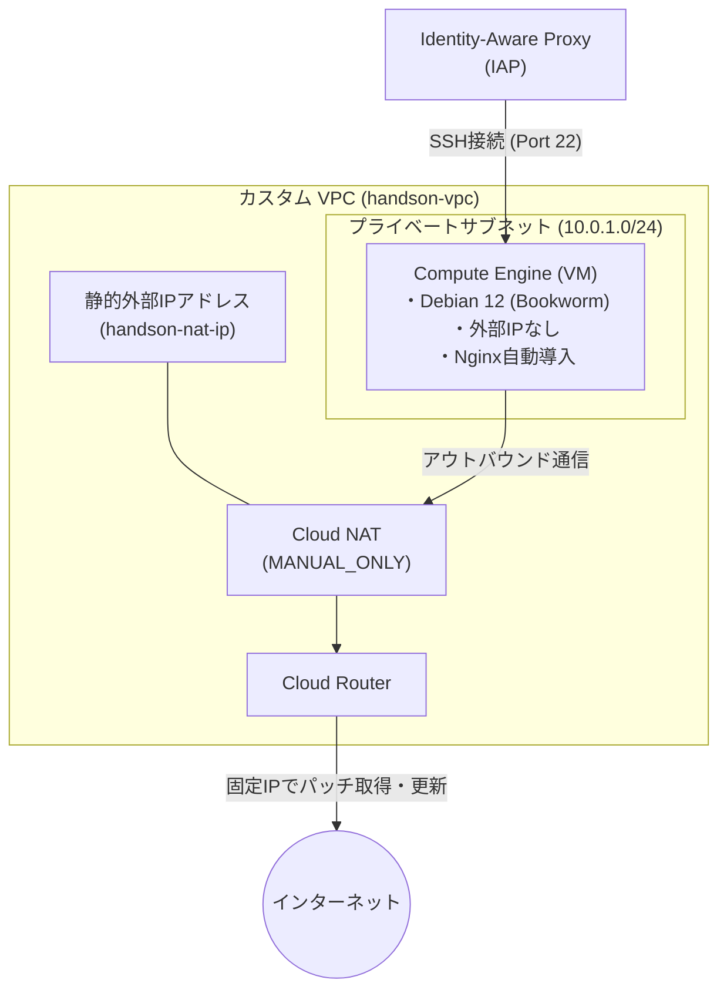

# シナリオ1：【IaaS】VPCとCompute Engineで作るセキュアなWebサーバー環境

## 概要

Google Cloud上にカスタムVPCネットワークを構築し、外部IPアドレスを持たないプライベートなCompute Engine（VM）インスタンスを作成します。事前に確保した静的IPアドレスを使った **Cloud NAT** を経由し、外部へ通信を行う実践的な構成です。VMのOSには Google Cloud Ops Agent に対応した **Debian 12 (Bookworm)** を採用しています。

## 構成図

## 作成されるリソース

* **VPC / Subnet**: 独自定義したプライベートネットワーク空間
* **External IP Address**: Cloud NAT専用に事前確保する静的外部IPアドレス（`google_compute_address`）
* **Cloud Router / Cloud NAT**: 事前作成した静的IPを使ってVMのアウトバウンド通信を中継するNAT環境
* **Firewall Rule**: IAP（35.235.240.0/20）からのSSH接続（Port 22）のみを許可するセキュリティルール
* **Compute Engine (VM)**: `debian-12` イメージを使用した `e2-micro` インスタンス。起動時スクリプトでNginxを自動セットアップ

## このハンズオンで学べること

* Dynamic/Auto割り当てではなく、固定IP（`google_compute_address`）を明示的に定義・アタッチするCloud NATの構成手法
* Ops Agent等を使ったモニタリング拡張を見据えた最新標準OS（Debian 12）でのプロビジョニング
* `metadata_startup_script` を用いた初期セットアップの自動化
