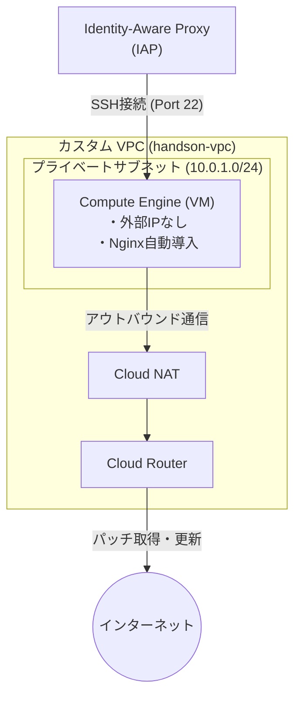

# シナリオ1：【IaaS】VPCとCompute Engineで作るセキュアなWebサーバー環境

## 概要

Google Cloud上にカスタムVPCネットワークを構築し、外部IPアドレスを持たないプライベートなCompute Engine（VM）インスタンスを作成します。パブリックインターネットからの直接攻撃を防ぎつつ、Cloud NATを経由して安全にパッチ適用やパッケージインストール（Nginx）を行うセキュアなIaaS基盤の構築手法を学びます。

## 構成図

## 作成されるリソース

* **VPC / Subnet**: 独自定義したプライベートネットワーク空間
* **Cloud Router / Cloud NAT**: パブリックIPを持たないVMが外部（インターネット）へ通信するためのNAT環境
* **Firewall Rule**: IAP（35.235.240.0/20）からのSSH接続（Port 22）のみを許可するセキュリティルール
* **Compute Engine (VM)**: `e2-micro` インスタンス。起動時スクリプト（`metadata_startup_script`）でNginxを自動セットアップ

## このハンズオンで学べること

* Terraformを使った基本ネットワーク（VPC / Subnet）の構築手法
* 外部IPを持たないプライベートVMの安全な運用設計
* `metadata_startup_script` を用いたプロビジョニングの自動化
* `depends_on` によるリソース作成順序の依存関係制御
