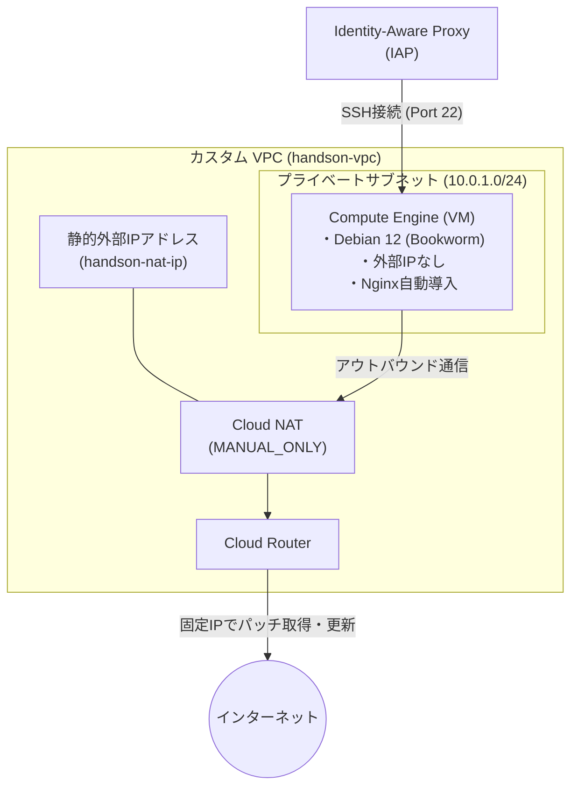

# シナリオ1：【IaaS】VPCとCompute Engineで作るセキュアなWebサーバー環境

## 概要

Google Cloud上にカスタムVPCネットワークを構築し、外部IPアドレスを持たないプライベートなCompute Engine（VM）インスタンスを作成します。事前に確保した静的IPアドレスを使った **Cloud NAT** を経由し、外部へ通信を行う実践的な構成です。VMのOSには Google Cloud Ops Agent に対応した **Debian 12 (Bookworm)** を採用しています。

## 構成図




## 作成されるリソース

* **VPC / Subnet**: 独自定義したプライベートネットワーク空間
* **External IP Address**: Cloud NAT専用に事前確保する静的外部IPアドレス（`google_compute_address`）
* **Cloud Router / Cloud NAT**: 事前作成した静的IPを使ってVMのアウトバウンド通信を中継するNAT環境
* **Firewall Rule**: IAP（35.235.240.0/20）からのSSH接続（Port 22）のみを許可するセキュリティルール
* **Compute Engine (VM)**: `debian-12` イメージを使用した `e2-micro` インスタンス。起動時スクリプトでNginxを自動セットアップ

## このハンズオンで学べること

* Dynamic/Auto割り当てではなく、固定IP（`google_compute_address`）を明示的に定義・アタッチするCloud NATの構成手法
* Ops Agent等を使ったモニタリング拡張を見据えた最新標準OS（Debian 12）でのプロビジョニング
* `metadata_startup_script` を用いた初期セットアップの自動化

## 実行コマンド

### Terraform コマンドのインストール

- 環境に応じてインストールしてください

```
# Cloud Console の場合
wget -O - https://apt.releases.hashicorp.com/gpg | sudo gpg --dearmor -o /usr/share/keyrings/hashicorp-archive-keyring.gpg
echo "deb [arch=$(dpkg --print-architecture) signed-by=/usr/share/keyrings/hashicorp-archive-keyring.gpg] https://apt.releases.hashicorp.com $(grep -oP '(?<=UBUNTU_CODENAME=).*' /etc/os-release || lsb_release -cs) main" | sudo tee /etc/apt/sources.list.d/hashicorp.list
sudo apt update && sudo apt install terraform

# インストール成功を確認するためにバージョンの確認
/usr/bin/terraform version

# path を通す
echo 'export PATH=$PATH:/usr/bin' >> ~/.bashrc
source ~/.bashrc
```


### 1. Google Cloud 認証・初期設定

- 1-1. gcloud CLI のユーザー認証（ブラウザが起動します）

```
gcloud auth login
```

- 1-2. Terraformが GCP API を操作するためのローカル認証情報（ADC）を発行

```
gcloud auth application-default login
```

- 1-3. (任意) TerraformのAPI有効化処理自体に必要な「Service Usage API」を有効化

```
gcloud services enable serviceusage.googleapis.com
gcloud services enable cloudresourcemanager.googleapis.com
```

### 2. Terraform の実行

- 2-1. ワークスペースの初期化 (プロバイダーのダウンロード)

```
terraform init
```

- 2-2. 実行計画の確認 (作成されるリソースの事前チェック)

```
terraform plan
```

- 2-3. リソースの作成実行

```
terraform apply
```

### 3. 後片付け（リソース削除）

- 3-1. 作成した全リソースの削除

```
terraform destroy
```