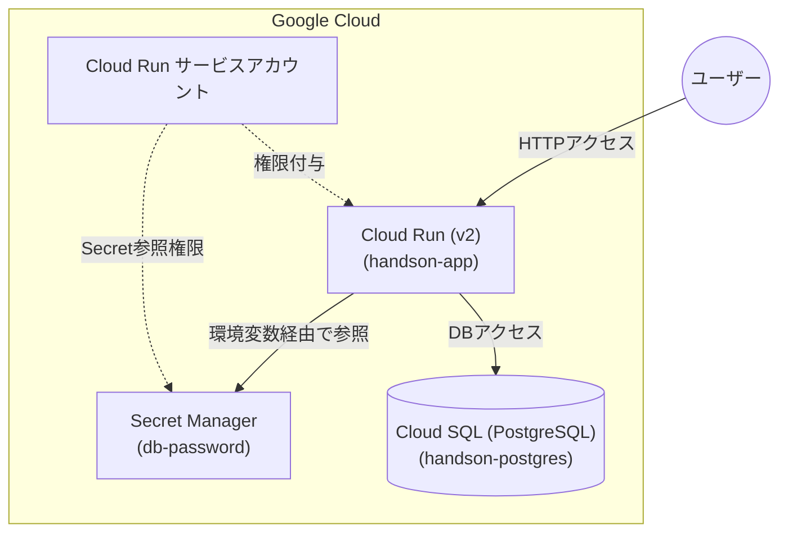

# シナリオ2：【PaaS】Cloud Run × Cloud SQLのモダンプラットフォーム構成

## 概要

サーバー管理が不要なコンテナ実行環境 **Cloud Run** と、フルマネージドデータベース **Cloud SQL (PostgreSQL)** を連携させるモダンなアプリケーション基盤を構築します。データベースの接続パスワードは Terraform の `random` プロバイダーで自動生成し、**Secret Manager** で安全に暗号化保存して Cloud Run へ注入する構成を実践します。

## 構成图

## 作成されるリソース

* **Cloud Run (v2)**: アプリケーションコンテナの実行環境（サンプルコンテナイメージを使用）
* **Cloud SQL**: PostgreSQL 14 インスタンス (`db-f1-micro`) およびデータベースユーザー
* **Secret Manager**: DBパスワードを安全に管理・保管するシークレットストア
* **Service Account & IAM**: Cloud RunがSecret Managerから安全に暗号キーを取得するための最小権限設定
* **Random Password**: 予測不可能な16桁のランダムパスワード自動生成

## このハンズオンで学べること

* PaaS（Cloud Run）とマネージドDB（Cloud SQL）のインフラコード化
* 機密情報（DBパスワード等）をハードコードせず、Secret Managerを挟んで安全にデプロイする設計
* サービスアカウントを用いた最小権限（IAM）の付与パターン

---
