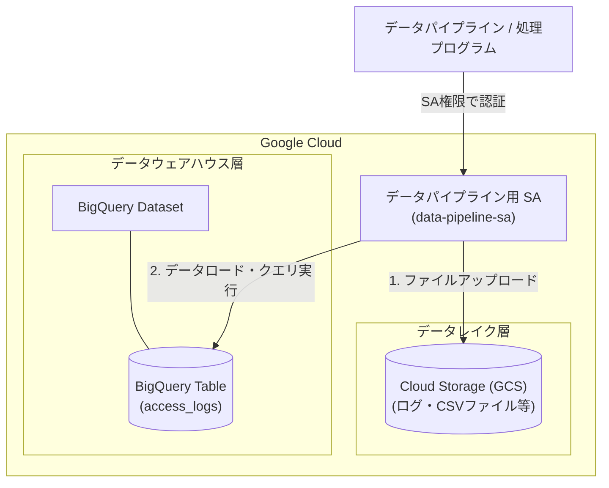

# シナリオ3：【SaaS / マネージド】Cloud Storage × BigQueryで作る分析基盤

## 概要

大容量データを保存するデータレイク **Cloud Storage (GCS)** と、超高速なデータウェアハウス **BigQuery** を組み合わせた、完全サーバーレスなデータ分析プラットフォームを構築します。データパイプライン処理を行うプログラム（サービスアカウント）を発行し、各サービスに対する適切な操作権限（IAM）を設定します。

## 構成図

## 作成されるリソース

* **Cloud Storage (GCS Bucket)**: Rawデータ（ログやCSV等）を保持するデータレイク用バケット
* **BigQuery Dataset & Table**: 構造化データを格納する分析用データベースとテーブル（スキーマ自動定義付き）
* **Service Account**: データパイプライン（バッチ処理等）専用の実行アカウント
* **IAM Member**: サービスアカウントに対する「GCS書き込み権限（`storage.objectAdmin`）」および「BigQueryデータ編集権限（`bigquery.dataEditor`）」の付与

## このハンズオンで学べること

* GCSやBigQueryなど、サーバーレス・マネージドサービス群の環境構築
* JSON形式を用いた BigQuery テーブルスキーマ（カラム定義）のコード管理
* リソース削除保護設定（`deletion_protection` / `force_destroy`）の扱いとハンズオン時の注意事項
